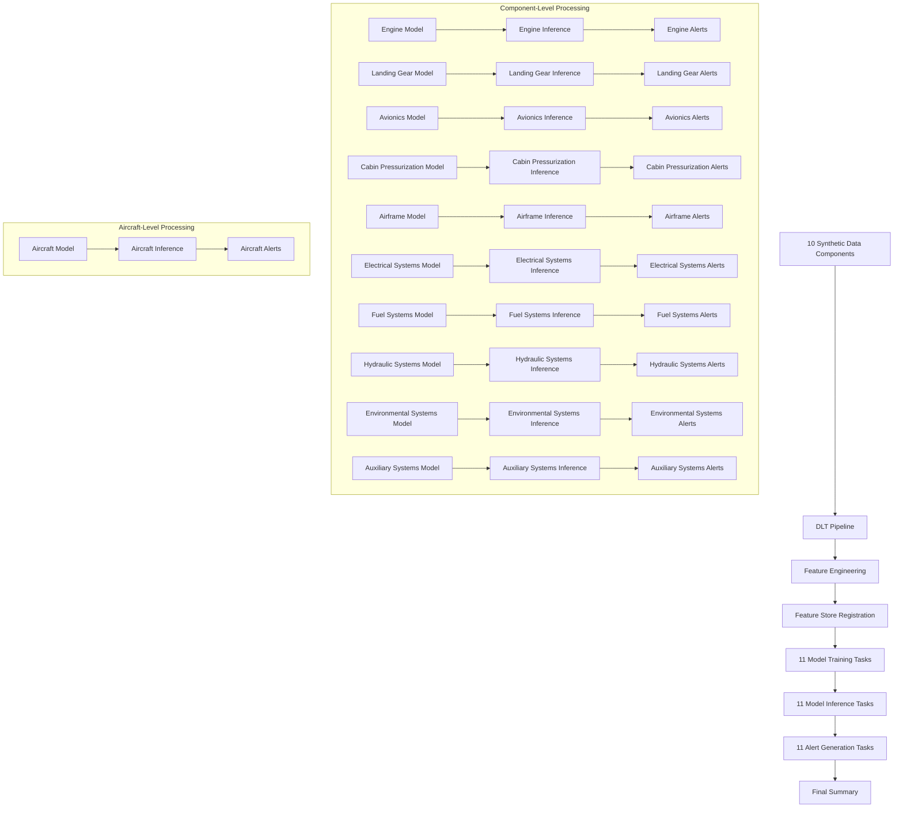

# 🛫 AeroTwin: Predictive Maintenance with Digital Twins in Databricks

This project simulates a comprehensive digital twin for commercial aircraft using synthetic sensor and maintenance data. Built on Databricks with Delta Live Tables (DLT), MLflow, Unity Catalog, and Feature Store, it demonstrates end-to-end predictive maintenance at both aircraft and component levels with parallel processing capabilities.

---

## 🚀 End-to-End Pipeline Architecture



---

## 📚 Complete Notebook Workflow

### 🏗️ **Setup & Configuration**
| Notebook Name | Purpose |
|---------------|---------|
| `00_Instructions_and_Workflow.ipynb` | 🧭 Project overview and workflow instructions |
| `00_ClusterManagement/98_create_ml_cluster.ipynb` | 🖥️ Creates ML-enabled cluster for workflows |
| `01_DeltaTableManagement/01_Table_Creation.ipynb` | 🏗️ Creates all required Delta tables in Unity Catalog |
| `01_DeltaTableManagement/✈️ Entity Relationship Diagram for Aircraft Digital Twins.ipynb` | 📊 ERD for the digital twin data model |

### 🧪 **Synthetic Data Generation (10 Components)**
| Notebook Name | Purpose |
|---------------|---------|
| `02_SyntheticData/02_01_Synthetic_Data_Generation_v2.ipynb` | 🧪 Main synthetic data generation orchestrator |
| `02_SyntheticData/02_02_Engine_Data_Generation.ipynb` | 🔧 Engine component synthetic data |
| `02_SyntheticData/02_03_CabinPressurization_Data_Generation.ipynb` | 🛩️ Cabin pressurization component data |
| `02_SyntheticData/02_04_Airframe_Synthetic_Data_Generation.ipynb` | ✈️ Airframe component synthetic data |
| `02_SyntheticData/02_05_LandingGear_Data_Generation.ipynb` | 🛬 Landing gear component data |
| `02_SyntheticData/02_06_Avionics_Data_Generation.ipynb` | 🎛️ Avionics component synthetic data |
| `02_SyntheticData/02_07_ElectricalSystems_Data_Generation.ipynb` | ⚡ Electrical systems component data |
| `02_SyntheticData/02_08_FuelSystems_Data_Generation.ipynb` | ⛽ Fuel systems component synthetic data |
| `02_SyntheticData/02_09_HydraulicSystems_Data_Generation.ipynb` | 🔧 Hydraulic systems component data |
| `02_SyntheticData/02_10_EnvironmentalSystems_Data_Generation.ipynb` | 🌡️ Environmental systems component data |

### 🔄 **Data Processing & Feature Engineering**
| Notebook Name | Purpose |
|---------------|---------|
| `03_WorkflowsAndPipelines/03_03_DLT_Pipeline_Full_Restored.py` | 🔄 Complete DLT pipeline for all 10 components |
| `03B_FeatureRegistration/03B_Feature_Store_Registration.ipynb` | 🧠 Registers all component features to Feature Store |

### 🎯 **Model Training (11 Models)**
| Notebook Name | Purpose |
|---------------|---------|
| `04_ModelTrainingAndInference/04_Model_Training_And_Registration.ipynb` | 🎯 Full aircraft model training |
| `04_ModelTrainingAndInference/04_01_Engine_Model_Training.ipynb` | 🔧 Engine component model training |
| `04_ModelTrainingAndInference/04_02_LandingGear_Model_Training.ipynb` | 🛬 Landing gear component model training |
| `04_ModelTrainingAndInference/04_03_Avionics_Model_Training.ipynb` | 🎛️ Avionics component model training |
| `04_ModelTrainingAndInference/04_04_CabinPressurization_Model_Training.ipynb` | 🛩️ Cabin pressurization component model training |
| `04_ModelTrainingAndInference/04_05_Airframe_Model_Training.ipynb` | ✈️ Airframe component model training |
| `04_ModelTrainingAndInference/04_06_ElectricalSystems_Model_Training.ipynb` | ⚡ Electrical systems component model training |
| `04_ModelTrainingAndInference/04_07_FuelSystems_Model_Training.ipynb` | ⛽ Fuel systems component model training |
| `04_ModelTrainingAndInference/04_08_HydraulicSystems_Model_Training.ipynb` | 🔧 Hydraulic systems component model training |
| `04_ModelTrainingAndInference/04_09_EnvironmentalSystems_Model_Training.ipynb` | 🌡️ Environmental systems component model training |
| `04_ModelTrainingAndInference/04_10_AuxiliarySystems_Model_Training.ipynb` | 🔧 Auxiliary systems component model training |

### 📈 **Model Inference (11 Models)**
| Notebook Name | Purpose |
|---------------|---------|
| `04_ModelTrainingAndInference/05_Model_Inference.ipynb` | 📈 Full aircraft model inference |
| `04_ModelTrainingAndInference/05_01_Engine_Model_Inference.ipynb` | 🔧 Engine component model inference |
| `04_ModelTrainingAndInference/05_02_LandingGear_Model_Inference.ipynb` | 🛬 Landing gear component model inference |
| `04_ModelTrainingAndInference/05_03_Avionics_Model_Inference.ipynb` | 🎛️ Avionics component model inference |
| `04_ModelTrainingAndInference/05_04_CabinPressurization_Model_Inference.ipynb` | 🛩️ Cabin pressurization component model inference |
| `04_ModelTrainingAndInference/05_05_Airframe_Model_Inference.ipynb` | ✈️ Airframe component model inference |
| `04_ModelTrainingAndInference/05_06_ElectricalSystems_Model_Inference.ipynb` | ⚡ Electrical systems component model inference |
| `04_ModelTrainingAndInference/05_07_FuelSystems_Model_Inference.ipynb` | ⛽ Fuel systems component model inference |
| `04_ModelTrainingAndInference/05_08_HydraulicSystems_Model_Inference.ipynb` | 🔧 Hydraulic systems component model inference |
| `04_ModelTrainingAndInference/05_09_EnvironmentalSystems_Model_Inference.ipynb` | 🌡️ Environmental systems component model inference |
| `04_ModelTrainingAndInference/05_10_AuxiliarySystems_Model_Inference.ipynb` | 🔧 Auxiliary systems component model inference |

### ⚠️ **Alert Generation (11 Components)**
| Notebook Name | Purpose |
|---------------|---------|
| `04_ModelTrainingAndInference/06_Model_Inference_To_Alerts_table.ipynb` | ⚠️ Full aircraft alert generation |
| `04_ModelTrainingAndInference/06_01_Engine_Model_Inference_To_Alerts.ipynb` | 🔧 Engine component alert generation |
| `04_ModelTrainingAndInference/06_02_LandingGear_Model_Inference_To_Alerts.ipynb` | 🛬 Landing gear component alert generation |
| `04_ModelTrainingAndInference/06_03_Avionics_Model_Inference_To_Alerts.ipynb` | 🎛️ Avionics component alert generation |
| `04_ModelTrainingAndInference/06_04_CabinPressurization_Model_Inference_To_Alerts.ipynb` | 🛩️ Cabin pressurization component alert generation |
| `04_ModelTrainingAndInference/06_05_Airframe_Model_Inference_To_Alerts.ipynb` | ✈️ Airframe component alert generation |
| `04_ModelTrainingAndInference/06_06_ElectricalSystems_Model_Inference_To_Alerts.ipynb` | ⚡ Electrical systems component alert generation |
| `04_ModelTrainingAndInference/06_07_FuelSystems_Model_Inference_To_Alerts.ipynb` | ⛽ Fuel systems component alert generation |
| `04_ModelTrainingAndInference/06_08_HydraulicSystems_Model_Inference_To_Alerts.ipynb` | 🔧 Hydraulic systems component alert generation |
| `04_ModelTrainingAndInference/06_09_EnvironmentalSystems_Model_Inference_To_Alerts.ipynb` | 🌡️ Environmental systems component alert generation |
| `04_ModelTrainingAndInference/06_10_AuxiliarySystems_Model_Inference_To_Alerts.ipynb` | 🔧 Auxiliary systems component alert generation |

### 🔄 **Workflow Management**
| Notebook Name | Purpose |
|---------------|---------|
| `03_WorkflowsAndPipelines/03_99_Setup_Workflow.ipynb` | 🔄 Creates comprehensive Databricks workflow with 46 tasks |
| `03_WorkflowsAndPipelines/03_999_Trigger Workflow.ipynb` | 🚀 Triggers the end-to-end workflow execution |

### 📊 **Visualization & Monitoring**
| Notebook Name | Purpose |
|---------------|---------|
| `05_Dashboards/Aerodemo Digital Twin Health Dashboard.lvdash.json` | 📊 Databricks Lakeview dashboard for health monitoring |

---

## ✈️ Digital Twin Strategy

This demo implements a **comprehensive Digital Twin architecture** that tracks both aircraft and component-level health in parallel, enabling real-time decision support for maintenance operations.

### 📌 **Aircraft-Level Twin**
- Combines sensor history with latest maintenance context
- Joins with reference metadata (capacity, range, engine type, etc.)
- Provides overall aircraft health assessment

### 🔩 **Component-Level Twins (10 Components)**
- **Engine**: Engine performance, temperature, vibration monitoring
- **Landing Gear**: Landing gear system health and wear analysis
- **Avionics**: Electronic systems and navigation equipment health
- **Cabin Pressurization**: Cabin pressure and environmental control systems
- **Airframe**: Structural integrity and airframe condition monitoring
- **Electrical Systems**: Electrical power distribution and battery systems
- **Fuel Systems**: Fuel management, storage, and distribution systems
- **Hydraulic Systems**: Hydraulic power and control systems
- **Environmental Systems**: Climate control and environmental management
- **Auxiliary Systems**: Secondary systems and backup equipment

---

## 🧠 Feature Engineering Highlights

Each component's `sensor_features` table includes:

| Feature Category | Description |
|-----------------|-------------|
| **Time-based Features** | Rolling averages (7-day, 30-day), trend indicators |
| **Maintenance Context** | Days since last maintenance, maintenance history |
| **Operational Metrics** | Component-specific sensor readings and thresholds |
| **Anomaly Indicators** | Previous anomaly scores, degradation patterns |
| **Metadata** | Aircraft model, component type, operational parameters |

These features are used to train **RandomForestClassifier** models for each component and are registered into the **Databricks Feature Store** for governance and reuse.

---

## 📊 Component-Specific Alert Tables

Each component writes to its own dedicated alert table to enable parallel processing:

| Component | Alert Table | Purpose |
|-----------|-------------|---------|
| **Aircraft (Full)** | `arao.aerodemo.aircraft_alerts` | Overall aircraft health alerts |
| **Engine** | `arao.aerodemo.engine_alerts` | Engine-specific anomaly alerts |
| **Landing Gear** | `arao.aerodemo.landinggear_alerts` | Landing gear-specific anomaly alerts |
| **Avionics** | `arao.aerodemo.avionics_alerts` | Avionics-specific anomaly alerts |
| **Cabin Pressurization** | `arao.aerodemo.cabinpressurization_alerts` | Cabin pressurization-specific anomaly alerts |
| **Airframe** | `arao.aerodemo.airframe_alerts` | Airframe-specific anomaly alerts |
| **Electrical Systems** | `arao.aerodemo.electricalsystems_alerts` | Electrical systems-specific anomaly alerts |
| **Fuel Systems** | `arao.aerodemo.fuelsystems_alerts` | Fuel systems-specific anomaly alerts |
| **Hydraulic Systems** | `arao.aerodemo.hydraulicsystems_alerts` | Hydraulic systems-specific anomaly alerts |
| **Environmental Systems** | `arao.aerodemo.environmentalsystems_alerts` | Environmental systems-specific anomaly alerts |
| **Auxiliary Systems** | `arao.aerodemo.auxiliarysystems_alerts` | Auxiliary systems-specific anomaly alerts |

### Benefits:
- ✅ **Parallel Execution**: All components run simultaneously without table conflicts
- ✅ **Component Isolation**: Each component's alerts are stored separately
- ✅ **Independent Analysis**: Component-specific dashboards and monitoring
- ✅ **Data Governance**: Easier access controls and retention policies per component

---

## 🔄 Workflow Architecture

The comprehensive workflow includes **46 total tasks**:

```
Synthetic Data Generation (10 tasks)
    ↓
DLT Pipeline (1 task)
    ↓
Feature Registration (1 task)
    ↓
┌─────────────────────────────────────────────────────────┐
│ Aircraft Model Training    │ Component Model Training   │
│                            │ (10 parallel tasks)        │
└─────────────────────────────────────────────────────────┘
    ↓                               ↓
┌─────────────────────────────────────────────────────────┐
│ Aircraft Model Inference   │ Component Model Inference  │
│                            │ (10 parallel tasks)        │
└─────────────────────────────────────────────────────────┘
    ↓                               ↓
┌─────────────────────────────────────────────────────────┐
│ Aircraft Alerts           │ Component Alerts            │
│                           │ (10 parallel tasks)         │
└─────────────────────────────────────────────────────────┘
    ↓                               ↓
            Final Summary Task
```

---

## 🧩 Inference Options

For each component, you can:
- Load a model by version (e.g., `/2`)
- Load by alias (`@champion`)
- Score new records using feature lookups from the feature store
- Generate component-specific alerts

---

## 🛠️ Unity Catalog & Feature Store Integration

Benefits:
- 🔐 Centralized governance with table lineage and RBAC
- 📦 Reusability across training and inference jobs
- 🧪 Easier tracking and auditing of feature usage
- 🚀 Parallel processing capabilities for all components

---

## 🧰 Technologies Used

- **Databricks Delta Live Tables (DLT)** - Data processing pipeline
- **Databricks Feature Store** - Feature management and governance
- **MLflow** - Model Registry, experiment tracking, and deployment
- **Unity Catalog** - Data governance and access control
- **scikit-learn** - Random Forest models for each component
- **Pandas, PySpark** - Data manipulation and processing
- **Databricks Workflows** - Orchestration of 46 parallel tasks

---

## 📦 Current Capabilities

- ✅ **10 Component Synthetic Data Generation** - Realistic sensor data for all aircraft systems
- ✅ **Comprehensive DLT Pipeline** - End-to-end data processing for all components
- ✅ **11 Parallel Model Training** - Aircraft-level + 10 component-level models
- ✅ **11 Parallel Model Inference** - Real-time scoring for all components
- ✅ **11 Component-Specific Alert Tables** - Isolated alert storage for parallel processing
- ✅ **Feature Store Integration** - Centralized feature management
- ✅ **Unity Catalog Governance** - Complete data lineage and access control
- ✅ **Comprehensive Workflow** - 46-task orchestrated pipeline
- ✅ **Digital Twin Dashboard** - Real-time health monitoring

---

## 🔍 Alert Inference Traceability

The system provides comprehensive traceability from alerts back to the inference that generated them. This enables drill-down analysis and debugging of alert generation.

📖 **[Alert Inference Traceability Guide](ALERT_INFERENCE_TRACEABILITY.md)** - Complete documentation on how to trace alerts back to their source inference data and models.

### Key Features:
- 🔗 **Inference Trace IDs** - Every alert links to its source inference record
- 📊 **Drill-Down Views** - Unified views for easy navigation from alerts to inference
- 🎯 **Component Isolation** - Trace alerts to specific component inference tables
- 📈 **Dashboard Integration** - Ready-to-use views for dashboard drill-down functionality

---

## 📁 Complete Folder Structure

```
databricks-aerodemo/
├── 00_ClusterManagement/
│   └── 98_create_ml_cluster.ipynb
├── 01_DeltaTableManagement/
│   ├── ✈️ Entity Relationship Diagram for Aircraft Digital Twins.ipynb
│   └── 01_Table_Creation.ipynb
├── 02_SyntheticData/
│   ├── 02_01_Synthetic_Data_Generation_v2.ipynb
│   ├── 02_02_Engine_Data_Generation.ipynb
│   ├── 02_03_CabinPressurization_Data_Generation.ipynb
│   ├── 02_04_Airframe_Synthetic_Data_Generation.ipynb
│   ├── 02_05_LandingGear_Data_Generation.ipynb
│   ├── 02_06_Avionics_Data_Generation.ipynb
│   ├── 02_07_ElectricalSystems_Data_Generation.ipynb
│   ├── 02_08_FuelSystems_Data_Generation.ipynb
│   ├── 02_09_HydraulicSystems_Data_Generation.ipynb
│   ├── 02_10_EnvironmentalSystems_Data_Generation.ipynb
│   └── 101_Final_Summary_Task.ipynb
├── 03_WorkflowsAndPipelines/
│   ├── 03_03_DLT_Pipeline_Full_Restored.py
│   ├── 03_88_delete_workflow.ipynb
│   ├── 03_99_Setup_Workflow.ipynb
│   ├── 03_999_Trigger Workflow.ipynb
│   └── 101_Final_Summary_Task.ipynb
├── 03B_FeatureRegistration/
│   └── 03B_Feature_Store_Registration.ipynb
├── 04_ModelTrainingAndInference/
│   ├── 04_Model_Training_And_Registration.ipynb
│   ├── 04_01_Engine_Model_Training.ipynb
│   ├── 04_02_LandingGear_Model_Training.ipynb
│   ├── 04_03_Avionics_Model_Training.ipynb
│   ├── 04_04_CabinPressurization_Model_Training.ipynb
│   ├── 04_05_Airframe_Model_Training.ipynb
│   ├── 04_06_ElectricalSystems_Model_Training.ipynb
│   ├── 04_07_FuelSystems_Model_Training.ipynb
│   ├── 04_08_HydraulicSystems_Model_Training.ipynb
│   ├── 04_09_EnvironmentalSystems_Model_Training.ipynb
│   ├── 04_10_AuxiliarySystems_Model_Training.ipynb
│   ├── 05_Model_Inference.ipynb
│   ├── 05_01_Engine_Model_Inference.ipynb
│   ├── 05_02_LandingGear_Model_Inference.ipynb
│   ├── 05_03_Avionics_Model_Inference.ipynb
│   ├── 05_04_CabinPressurization_Model_Inference.ipynb
│   ├── 05_05_Airframe_Model_Inference.ipynb
│   ├── 05_06_ElectricalSystems_Model_Inference.ipynb
│   ├── 05_07_FuelSystems_Model_Inference.ipynb
│   ├── 05_08_HydraulicSystems_Model_Inference.ipynb
│   ├── 05_09_EnvironmentalSystems_Model_Inference.ipynb
│   ├── 05_10_AuxiliarySystems_Model_Inference.ipynb
│   ├── 06_Model_Inference_To_Alerts_table.ipynb
│   ├── 06_01_Engine_Model_Inference_To_Alerts.ipynb
│   ├── 06_02_LandingGear_Model_Inference_To_Alerts.ipynb
│   ├── 06_03_Avionics_Model_Inference_To_Alerts.ipynb
│   ├── 06_04_CabinPressurization_Model_Inference_To_Alerts.ipynb
│   ├── 06_05_Airframe_Model_Inference_To_Alerts.ipynb
│   ├── 06_06_ElectricalSystems_Model_Inference_To_Alerts.ipynb
│   ├── 06_07_FuelSystems_Model_Inference_To_Alerts.ipynb
│   ├── 06_08_HydraulicSystems_Model_Inference_To_Alerts.ipynb
│   ├── 06_09_EnvironmentalSystems_Model_Inference_To_Alerts.ipynb
│   └── 06_10_AuxiliarySystems_Model_Inference_To_Alerts.ipynb
├── 05_Dashboards/
│   └── Aerodemo Digital Twin Health Dashboard.lvdash.json
├── 999_Misc/
│   ├── Post DLT Utility Cells.ipynb
│   ├── Scratch Notebook.ipynb
│   ├── test_config_notebook.ipynb
│   ├── test_config_script.py
│   ├── Test_Config_Store.ipynb
│   └── ToDo.ipynb
├── conf/
│   ├── __init__.py
│   ├── 01_Create_Config_Store.ipynb
│   ├── 02_Manage_Config_Store.ipynb
│   ├── config_reader.py
│   └── Readme.md.ipynb
├── config/
│   ├── __init__.py
│   └── aerodemo_config.py
├── bundle.yml
├── databricks.yml
├── COMPONENT_ALERT_TABLES.md
├── README.md
└── UPDATED_README.md
```

---

## ✍️ Author

Anand Rao – Senior Solutions Architect at Databricks  
GitHub: [honnuanand](https://github.com/honnuanand)

---

## 🛫 Let's Build the Future of Aviation Analytics with Databricks!

This project demonstrates the power of Databricks for building comprehensive digital twin solutions that enable predictive maintenance at both aircraft and component levels, with full parallel processing capabilities and enterprise-grade governance.