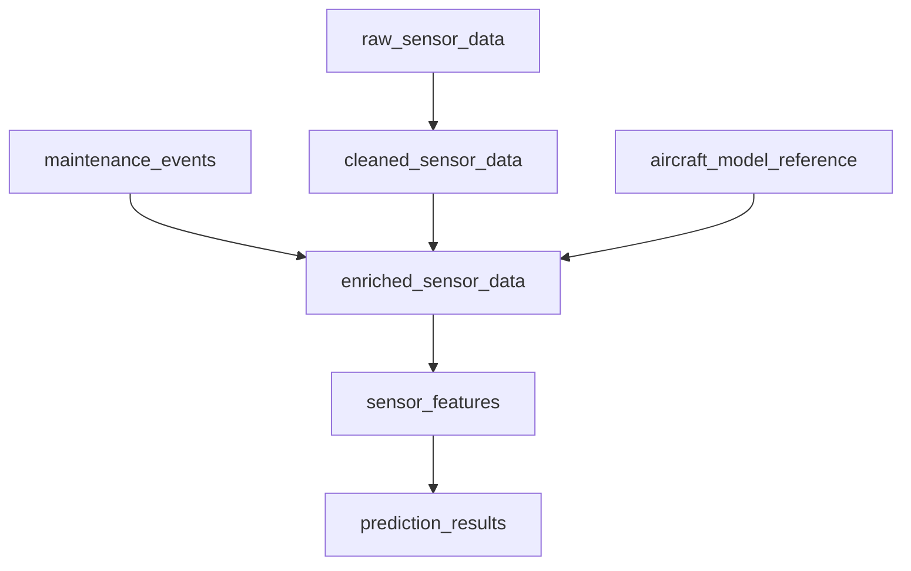

# 🛫 AeroDemo: Predictive Maintenance with Digital Twins in Databricks

This project simulates a digital twin for commercial aircraft using synthetic sensor and maintenance data. Built on Databricks with Delta Live Tables (DLT), MLflow, and Unity Catalog, it demonstrates how to engineer features, predict anomalies, and evolve toward a Digital Twin architecture at both aircraft and component levels.

---

## 🚀 End-to-End Pipeline



---

## 📚 Notebook Workflow

| Notebook Name                                | Purpose |
|---------------------------------------------|---------|
| `00_Overview_and_Instructions.md`           | 🧭 Describes the workflow and purpose of each notebook |
| `01_Table_Creation.ipynb`                   | 🏗️ Creates all required Delta tables in Unity Catalog |
| `02_Synthetic_Data_Generation.ipynb`        | 🧪 Generates synthetic CSVs for sensor and maintenance data |
| `03_DLT_Pipeline_Full.py`                   | 🔄 Delta Live Tables pipeline: ingest → clean → enrich → feature engineer → predict |
| `03A_Feature_Store_Registration.py`         | 🧠 Registers engineered features to Unity Catalog Feature Store |
| `04_Model_Training_And_Registration.ipynb`  | 🎯 Trains and registers ML model using `sensor_features` |
| `05_Model_Inference.ipynb`                  | 📈 Loads model by version or alias and runs inference |
| `06_High_Risk_Alert_Generation.ipynb`       | ⚠️ Writes high-risk predictions to `anomaly_alerts` table |

---

## ✈️ Digital Twin Strategy

This demo uses **Digital Twin concepts** to track both the aircraft and component-level health. The goal is to simulate real-time decision support for maintenance operations.

### 📌 Aircraft-Level Twin
- Combines sensor history with latest maintenance context
- Joins with reference metadata (capacity, range, engine type, etc.)

### 🔩 Component-Level Twin (Planned)
- Extend anomaly predictions to subsystems like engines, hydraulics, etc.
- Model degradation using time series or survival analysis

---

## 🧠 Feature Engineering Highlights

`sensor_features` table includes:

| Feature                 | Description |
|------------------------|-------------|
| `avg_engine_temp_7d`   | 7-day rolling average of engine temperature |
| `avg_vibration_7d`     | 7-day rolling average of vibration levels |
| `avg_rpm_7d`           | 7-day rolling average of engine RPM |
| `prev_anomaly`         | Previous day’s anomaly score |
| `days_since_maint`     | Number of days since last maintenance |
| `model`, `engine_type` | Aircraft metadata from reference table |

These features are used to train a **RandomForestClassifier**, and are registered into the **Databricks Feature Store** for governance and reuse.

---

## 🧩 Inference Options

You can:
- Load a model by version (e.g., `/2`)
- Load by alias (`@champion`)
- Score new records using feature lookups from the feature store

---

## 🛠️ Unity Catalog & Feature Store Integration

Benefits:
- 🔐 Centralized governance with table lineage and RBAC
- 📦 Reusability across training and inference jobs
- 🧪 Easier tracking and auditing of feature usage

---

## 🧰 Technologies Used

- Databricks Delta Live Tables (DLT)
- Databricks Feature Store
- MLflow (Model Registry, experiment tracking)
- Unity Catalog
- scikit-learn (Random Forest)
- Pandas, PySpark

---

## 📦 Coming Soon

- 🧭 What-if simulations using historical context
- 🧱 Component-level scoring
- 📊 Dashboard with Plotly Dash or Power BI integration
- 📡 Streaming-based twin updates

---

## ✍️ Author

Anand Rao – Senior Solutions Architect at Databricks  
GitHub: [honnuanand](https://github.com/honnuanand)

---

## 📁 Folder Structure

```
databricks-aerodemo/
├── 00_Overview_and_Instructions.md
├── 01_Table_Creation.ipynb
├── 02_Synthetic_Data_Generation.ipynb
├── 03_DLT_Pipeline_Full.py
├── 03A_Feature_Store_Registration.py
├── 04_Model_Training_And_Registration.ipynb
├── 05_Model_Inference.ipynb
├── 06_High_Risk_Alert_Generation.ipynb
├── resources/
│   └── aircraft_diagram.png
```

---

## 🛫 Let’s Build the Future of Aviation Analytics with Databricks!